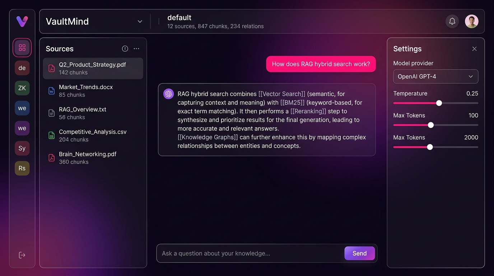
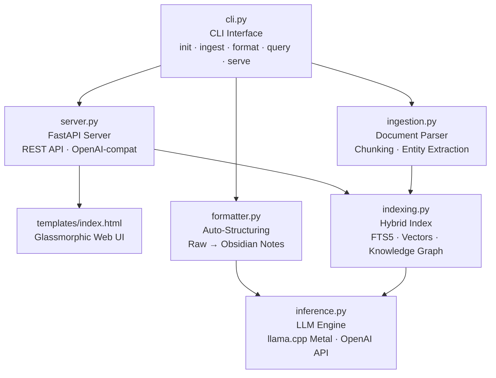
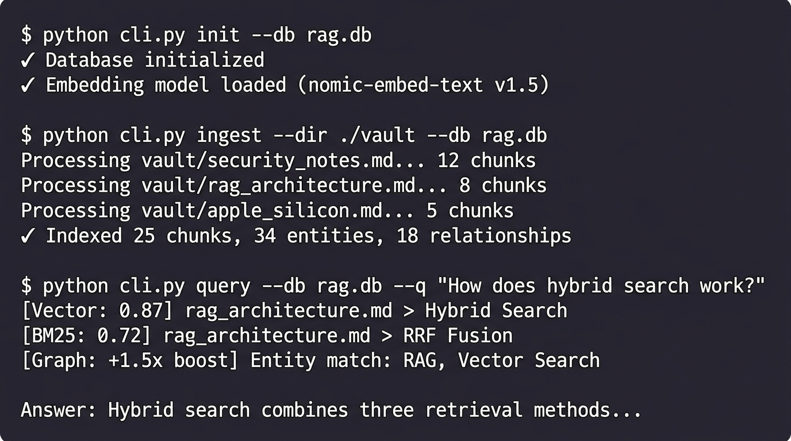

# 🧠 VaultMind


**Privacy-first local RAG system with Knowledge Graph for macOS Apple Silicon.** Your documents never leave your Mac. Hybrid search combines Vector embeddings, BM25 full-text, and Knowledge Graph with Reciprocal Rank Fusion for precise, citation-backed answers.

<p align="center">
  
</p>

---

## ✨ Key Features

- 🔒 **100% Local** — data never leaves your Mac, zero cloud dependency
- 🧠 **Hybrid RAG** — Vector + BM25 + Knowledge Graph with RRF fusion and graph boosting
- ⚡ **Apple Silicon Metal GPU** — native acceleration via llama.cpp
- 📝 **Obsidian-native** — wiki-links, YAML frontmatter, auto-linking concepts
- 🔄 **Auto-structuring** — raw text → structured Obsidian notes via LLM
- 📦 **Workspace isolation** — separate knowledge bases per project
- 🔌 **OpenAI-compatible API** — `/v1/chat/completions` endpoint for Cursor, Continue, etc.
- 📄 **Multi-format** — supports `.md`, `.txt`, `.docx` with drag-and-drop upload

---

## 🏗️ Architecture



---

## 🚀 Quick Start

```bash
# 1. Clone & setup environment
git clone https://github.com/YOUR_USERNAME/vaultmind.git
cd vaultmind
./setup_env.sh

# 2. Start the server
./run.sh

# 3. Open your browser
open http://localhost:8001
```

> **Note:** First run downloads ~2.2 GB of models (Qwen2.5-3B + nomic-embed-text) and compiles llama.cpp with Metal support. Requires Xcode Command Line Tools.

---

<p align="center">
  
</p>

## 💻 CLI Reference

| Command | Description | Example |
|---------|-------------|---------|
| `init` | Initialize database and download embedding models | `python cli.py init --db rag.db` |
| `ingest` | Parse and index documents from a directory | `python cli.py ingest --dir ./docs --db rag.db` |
| `format` | Auto-structure raw documents via LLM into Obsidian notes | `python cli.py format --input ./raw --vault ./vault` |
| `query` | Run a RAG query and get LLM-generated answer | `python cli.py query --db rag.db --q "your question"` |
| `serve` | Start the web server with UI and REST API | `python cli.py serve --host 127.0.0.1 --port 8001` |

---

## 🔌 API Endpoints

### Workspace Management

| Method | Endpoint | Description |
|--------|----------|-------------|
| `GET` | `/api/workspaces` | List all workspaces |
| `POST` | `/api/workspaces` | Create a new workspace |
| `POST` | `/api/workspaces/{id}/activate` | Set active workspace |
| `DELETE` | `/api/workspaces/{id}` | Delete a workspace |
| `GET` | `/api/workspaces/{id}/status` | Get workspace stats (chunks, entities, RAM) |
| `GET` | `/api/workspaces/{id}/config` | Get workspace configuration |
| `PUT` | `/api/workspaces/{id}/settings` | Update workspace settings |

### Documents & Search

| Method | Endpoint | Description |
|--------|----------|-------------|
| `GET` | `/api/workspaces/{id}/sources` | List indexed sources |
| `DELETE` | `/api/workspaces/{id}/sources/{file}` | Delete a source and re-index |
| `POST` | `/api/workspaces/{id}/upload` | Upload files (drag-and-drop) |
| `POST` | `/api/workspaces/{id}/query` | RAG query with citation |

### OpenAI-Compatible

| Method | Endpoint | Description |
|--------|----------|-------------|
| `POST` | `/v1/chat/completions` | Chat completions (active workspace) |
| `POST` | `/v1/chat/completions/{id}` | Chat completions (specific workspace) |

---

## ⚙️ Configuration

Each workspace has a `config.json`:

```json
{
    "provider": "local",
    "model_name": "models/Qwen2.5-3B-Instruct-Q4_K_M.gguf",
    "context_size": 8192,
    "openai_api_key": "",
    "openai_base_url": ""
}
```

| Field | Description |
|-------|-------------|
| `provider` | `"local"` for llama.cpp or `"cloud"` for OpenAI-compatible API |
| `model_name` | Path to GGUF model (local) or model name (cloud, e.g. `"deepseek-chat"`) |
| `context_size` | Context window size in tokens |
| `openai_api_key` | API key for cloud provider (only when `provider: "cloud"`) |
| `openai_base_url` | Base URL for cloud provider (e.g. `"https://api.deepseek.com"`) |

---

## 🔍 How It Works

1. **Ingestion** — Documents are parsed, YAML frontmatter extracted, and structural entities identified (wiki-links, tags, bold concepts)
2. **Chunking** — Text is split into overlapping chunks with heading-aware boundaries
3. **Indexing** — Each chunk is stored with:
   - **Vector embedding** (nomic-embed-text v1.5 GGUF)
   - **FTS5 full-text index** (SQLite BM25)
   - **Knowledge Graph** entries (entities + relationships)
4. **Hybrid Search** — Query triggers three parallel searches merged via **Reciprocal Rank Fusion** with graph boosting
5. **LLM Inference** — Retrieved context is fed to the LLM with strict grounding to minimize hallucinations

---

## 🛠️ Tech Stack

| Component | Technology |
|-----------|-----------|
| Language | Python 3.10+ |
| Web Framework | FastAPI + Uvicorn |
| Full-text Search | SQLite FTS5 (BM25) |
| Vector Search | numpy cosine similarity |
| Embeddings | nomic-embed-text v1.5 (GGUF) |
| LLM Runtime | llama.cpp (Metal GPU) |
| Document Parsing | python-docx, regex |
| Frontend | Vanilla HTML/CSS/JS (glassmorphic SPA) |

---

## 🤝 Contributing

See [CONTRIBUTING.md](CONTRIBUTING.md) for development setup, code style guidelines, and PR process.

---

## 📄 License

[MIT](LICENSE) © VaultMind Contributors
